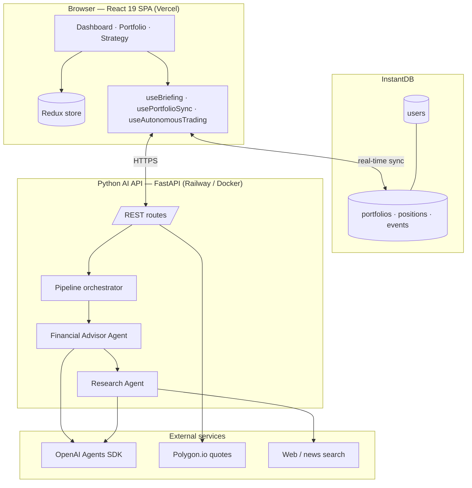
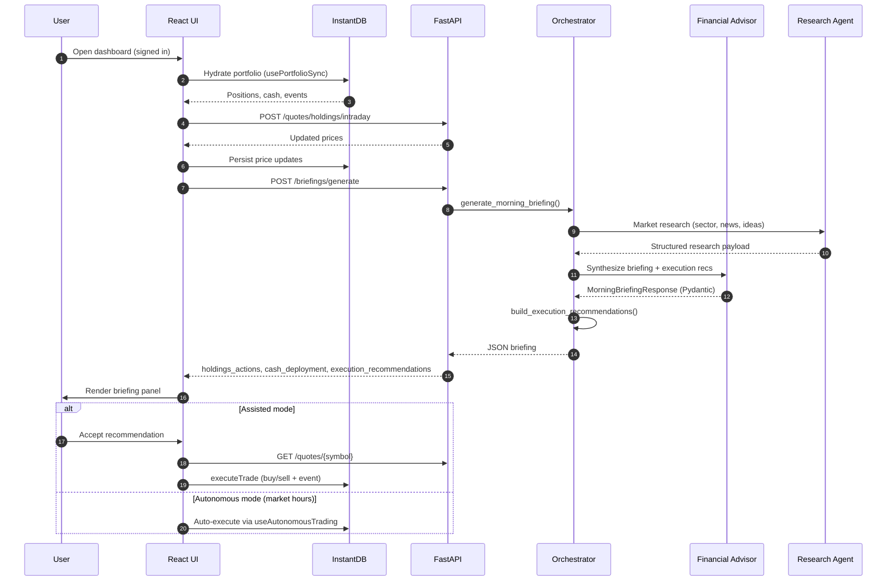
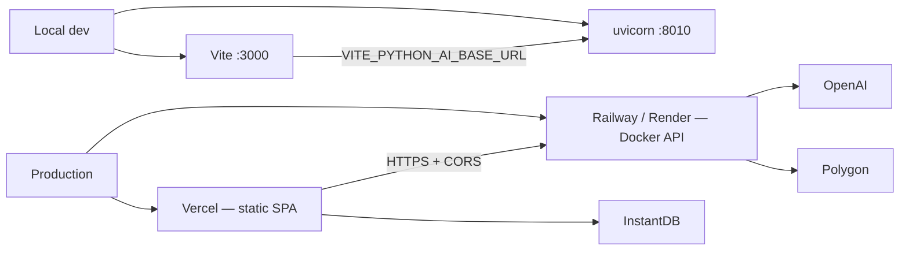

# InvestAI — System Architecture

InvestAI is a full-stack AI portfolio assistant: a React SPA talks to a FastAPI service that orchestrates OpenAI Agents, while portfolio state persists in InstantDB and market data comes from Polygon and research tools.

## System context



## Request flow — morning briefing



## AI pipeline

```mermaid
flowchart LR
    subgraph Input
        H[Holdings snapshot]
        C[Cash + strategy split]
        M[Trading mode]
    end

    subgraph ResearchAgent["Research Agent"]
        R1[search_web]
        R2[search_investment_news]
        R3[get_sector_performance]
        R4[run_market_research tool]
    end

    subgraph AdvisorAgent["Financial Advisor Agent"]
        A1[search_skills / read_skill]
        A2[Synthesize thesis + risk]
        A3[Top buys / do-not-buy]
    end

    subgraph Output["Structured output (Pydantic)"]
        O1[holdings_actions]
        O2[cash_deployment_options]
        O3[execution_recommendations]
        O4[risk_flags]
    end

    H --> ResearchAgent
    C --> AdvisorAgent
    M --> AdvisorAgent
    ResearchAgent --> AdvisorAgent
    AdvisorAgent --> Output
    Output --> Guardrails[Reserve floor · min/max positions · confidence threshold]
    Guardrails --> UI[React execution layer]
```



## Trading modes

| Mode | User role | AI role | Execution |
|------|-----------|---------|-----------|
| **Manual** | Full control | Briefing is informational only | User opens trade modal |
| **Assisted** | Approves each trade | Generates ranked recommendations | User accepts → quote → execute |
| **Autonomous** | Sets guardrails | Runs on schedule during market hours | Auto-executes within limits |

Guardrails (autonomous / assisted): 10% cash reserve, 4–10 positions, max 2% fee ratio, configurable confidence floor.

## Frontend layers

| Layer | Technology | Responsibility |
|-------|------------|----------------|
| Routing | React Router 7 | `/`, `/portfolio`, `/strategy`, `/about` |
| State | Redux 5 | Portfolio holdings, trade UI, sync flags |
| Persistence hook | `usePortfolioSync` | InstantDB ↔ Redux hydration |
| Briefing hook | `useBriefing` | Price refresh → generate → fallback to latest |
| Autonomous hook | `useAutonomousTrading` | Scheduled execution during US market hours |
| Styling | Tailwind CSS v4 | Responsive layout, dark mode, glass cards |
| Tests | Vitest + vitest-axe | Unit tests + WCAG 2.2 automated checks |

## Backend layers

| Layer | Path | Responsibility |
|-------|------|----------------|
| API | `python_ai/app/api/routes.py` | REST surface, quote cache, CORS |
| Orchestrator | `python_ai/app/pipeline/orchestrator.py` | Briefing + research coordination |
| Briefing logic | `python_ai/app/pipeline/briefing_logic.py` | Deterministic execution rules |
| Agents | `python_ai/app/agents/` | OpenAI Agents SDK + MCP tools |
| Schemas | `python_ai/app/schemas/` | Pydantic v2 request/response models |
| Persistence | `python_ai/app/pipeline/persistence.py` | Local briefing artifacts (fallback) |

## API surface

| Method | Path | Purpose |
|--------|------|---------|
| `GET` | `/health`, `/health/details` | Liveness + agent runtime status |
| `GET` | `/recommendations` | One-shot recommendation list |
| `GET` | `/research` | Market research only |
| `GET` | `/quotes/{symbol}` | Previous close (Polygon) |
| `POST` | `/quotes/holdings/intraday` | Batch intraday refresh |
| `GET` | `/briefings/latest` | Last persisted briefing |
| `POST` | `/briefings/generate` | Full morning briefing for portfolio |

Interactive docs: `{API_BASE_URL}/docs` (FastAPI OpenAPI).

## Data model (InstantDB)

```
users
  └── portfolios (cash, strategyGrowthPct, resetAt)
        ├── positions (symbol, shares, avgCost, price, totalValue)
        └── portfolio_events (buy/sell/deposit/withdraw audit trail)
```

Schema: [`instant.schema.ts`](instant.schema.ts) · Permissions: [`instant.perms.ts`](instant.perms.ts)

## Deployment topology



See [README.md](README.md) for environment variables and deploy commands.

## Design decisions

**Redux + InstantDB** — Redux is the UI source of truth; InstantDB provides auth, real-time sync, and offline-capable persistence without a custom backend for portfolio CRUD.

**Structured agent output** — Agents return Pydantic models, not free-form chat. Downstream Python and React code apply deterministic guardrails before any trade executes.

**Market-hours gating** — US equity session checks live in both `ui/src/lib/marketHours.js` and `python_ai/app/core/market_hours.py` so autonomous loops pause outside regular hours.

**Briefing fallback** — If generation fails, the UI loads `GET /briefings/latest` from server-side artifacts so the dashboard stays usable in demos.

## Testing

| Area | Command | Location |
|------|---------|----------|
| Frontend | `yarn test` | `ui/src/**/*.test.js` |
| Accessibility | `yarn test:a11y` | vitest-axe on key routes |
| Backend | `cd python_ai && uv run pytest` | `python_ai/tests/` |

Target: ≥90% coverage on touched modules per project standards.
