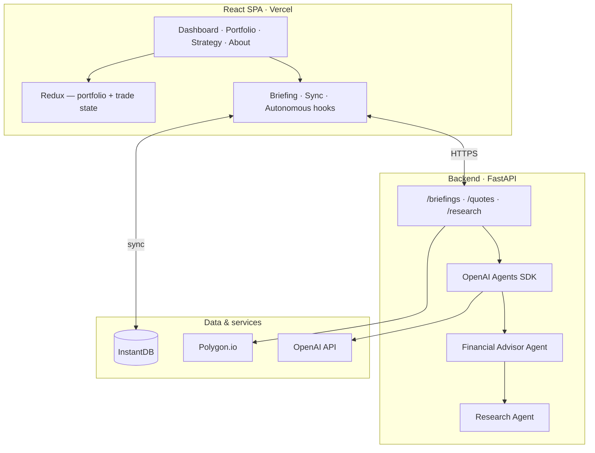
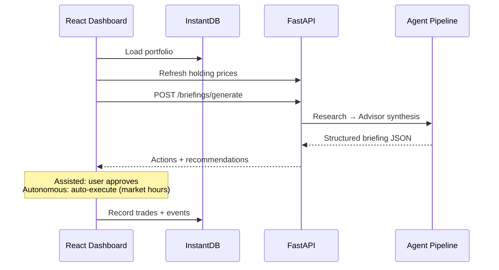

# InvestAI

**AI-powered portfolio assistant** — multi-agent research, daily briefings, and three trading automation modes on a production-grade React + FastAPI stack.

Built as a portfolio project demonstrating full-stack architecture, OpenAI Agents SDK orchestration, real-time persistence, and accessible UI engineering.

> **Disclaimer:** Decision-support and paper-style portfolio tooling only. Not financial advice. Market data may be delayed.

---

## At a glance

| | |
|---|---|
| **Frontend** | React 19, Vite 6, Redux 5, Tailwind CSS v4, Recharts |
| **Backend** | Python 3.12+, FastAPI, Pydantic v2, OpenAI Agents SDK |
| **Persistence** | InstantDB (auth, portfolios, positions, audit events) |
| **Market data** | Polygon.io, Yahoo sector quotes, web/news search |
| **Deploy** | Vercel (SPA) + Railway/Docker (API) |
| **Quality** | Vitest, vitest-axe (WCAG 2.2), pytest (≥90% target) |

**Repository:** [github.com/bkane56/stock_trader](https://github.com/bkane56/stock_trader)  
**Architecture deep-dive:** [ARCHITECTURE.md](ARCHITECTURE.md)

---

## What it does

1. **Morning briefing** — AI analyzes your holdings, sector context, and cash position; returns structured actions, deployment ideas, and optional trade recommendations.
2. **Three trading modes** — Manual (you trade), Assisted (you approve AI picks), Autonomous (AI executes within guardrails during market hours).
3. **Portfolio tracking** — Real-time sync via InstantDB with intraday price refresh, P&L metrics, and transaction history.
4. **Strategy builder** — Growth vs fixed-income allocation with visual breakdown.
5. **Risk guardrails** — Cash reserve floor, position count limits, confidence thresholds, and fee-ratio caps before autonomous execution.

---

## Architecture



### End-to-end briefing flow



Full diagrams (AI pipeline, deployment, data model): **[ARCHITECTURE.md](ARCHITECTURE.md)**

---

## Tech stack

### Frontend (`ui/src/`)

- **React 19** + **Vite 6** — SPA with lazy-loaded modals and strategy page
- **Redux 5** — Global portfolio and trade state; hydrated from InstantDB on load
- **React Router 7** — Client routing with accessible nav landmarks
- **Tailwind CSS v4** — Mobile-first responsive layout, dark mode
- **InstantDB** — Magic-code auth, real-time portfolio persistence
- **Vitest + Testing Library + vitest-axe** — Unit tests and WCAG checks

### Backend (`python_ai/`)

- **FastAPI** — REST API with OpenAPI at `/docs`
- **OpenAI Agents SDK** — Multi-agent orchestration with MCP tool servers
- **Pydantic v2** — Typed request/response contracts for UI consumption
- **uv** — Dependency and virtualenv management
- **pytest** — API, agent, briefing, and market-hours tests

### External integrations

- **Polygon.io** — End-of-day and previous-close quotes
- **Serper / Google News / Yahoo** — Research agent market intelligence
- **Optional MCP servers** — Fetch, Playwright, Brave search, Polygon MCP

---

## Project structure

```
stock_trader/
├── ui/src/
│   ├── App.jsx                 # Shell, routing, trade orchestration
│   ├── containers/             # Dashboard, Portfolio, Strategy, About
│   ├── hooks/                  # Briefing, portfolio sync, autonomous trading
│   ├── reducers/               # Redux slices
│   └── services/               # API clients, InstantDB store
├── python_ai/
│   ├── app/
│   │   ├── api/routes.py       # REST endpoints
│   │   ├── agents/             # Financial advisor + research agents
│   │   └── pipeline/           # Orchestrator, briefing logic, persistence
│   └── tests/
├── instant.schema.ts           # InstantDB schema
├── ARCHITECTURE.md             # System design (Mermaid diagrams)
└── vercel.json                 # Frontend deploy config
```

---

## Run locally

**Prerequisites:** Node.js 20+, Python 3.12+, [uv](https://docs.astral.sh/uv/)

### 1. Frontend

```bash
yarn install
cp .env.example .env.local   # add keys below
yarn dev                     # http://localhost:3000
```

### 2. Backend

```bash
cd python_ai && uv sync --extra dev
uv run uvicorn app.main:app --reload --host 127.0.0.1 --port 8010
```

Health check: `curl http://127.0.0.1:8010/health/details`

### 3. Environment variables

| Variable | Layer | Purpose |
|----------|-------|---------|
| `VITE_INSTANTDB_APP_ID` | Frontend | Portfolio persistence + auth |
| `VITE_PYTHON_AI_BASE_URL` | Frontend | API base URL (default `http://127.0.0.1:8010`) |
| `OPENAI_API_KEY` | Backend | Agent execution |
| `POLYGON_API_KEY` | Backend | Stock quotes |
| `AI_PROVIDER` / `AI_MODEL` | Backend | Model selection (default OpenAI) |

See [`.env.example`](.env.example) and [INSTANTDB_SETUP.md](INSTANTDB_SETUP.md) for the full list.

---

## Deploy

| Target | Guide |
|--------|--------|
| **Frontend (Vercel)** | `yarn vercel:preview` / `yarn vercel:prod` — see [Vercel section below](#vercel-deployment) |
| **API (Railway/Docker)** | [python_ai/DEPLOY.md](python_ai/DEPLOY.md) |
| **InstantDB** | [INSTANTDB_SETUP.md](INSTANTDB_SETUP.md) |

Set `VITE_PYTHON_AI_BASE_URL` on Vercel to your **HTTPS** API URL. Configure `CORS_ALLOW_ORIGINS` on the API for your Vercel domain.

---

## Vercel deployment

This repo includes `vercel.json` for Vite SPA routing.

```bash
npx vercel@48.6.0 link --yes -p stock-trader   # one-time
yarn vercel:dev                                 # local Vercel dev
yarn vercel:preview                             # preview deploy
yarn vercel:prod                                # production deploy
```

**Preview vs production:** Only `yarn vercel:prod` uses Production env vars. Preview deploys use Preview env vars in the Vercel dashboard.

**Required Vercel env vars:** `VITE_INSTANTDB_APP_ID`, `VITE_PYTHON_AI_BASE_URL` (HTTPS, not `127.0.0.1`).

CORS details: [python_ai/README.md](python_ai/README.md#cors-and-the-vercel-frontend)

---

## Engineering highlights

- **Structured AI outputs** — Pydantic schemas end-to-end; execution logic is deterministic, not prompt-dependent
- **Market-hours awareness** — Autonomous trading gated on US equity session (frontend + backend)
- **Accessibility** — Semantic landmarks, labeled controls, dialog focus traps, automated axe checks in CI path
- **Resilient briefing** — Generate with fallback to last persisted briefing artifact
- **Separation of concerns** — Agents recommend; guardrails and user mode decide execution

---

## Tests

```bash
yarn test                    # frontend unit + a11y
cd python_ai && uv run pytest   # backend
```

---

## License

Apache-2.0 (see file headers).
