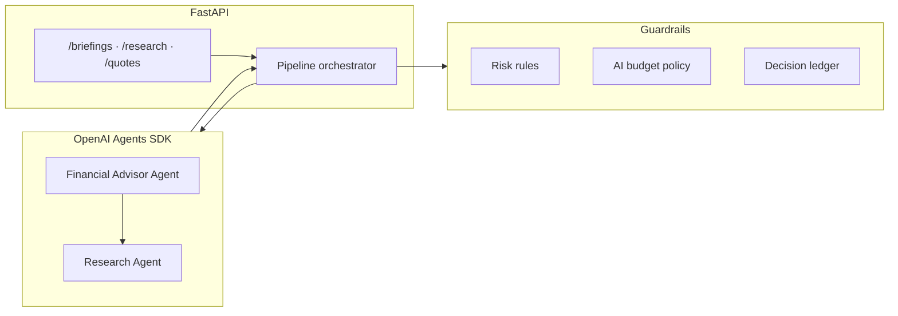

# InvestAI — Python AI Service

FastAPI backend for the InvestAI paper-trading assistant: a deterministic recommendation pipeline, OpenAI Agents SDK orchestration, and structured briefing output for the React frontend.

> **Disclaimer:** This service powers a hypothetical paper-trading demo. It does not execute real trades and does not provide financial advice.

**Full-stack context:** [../README.md](../README.md) · **Architecture diagrams:** [../ARCHITECTURE.md](../ARCHITECTURE.md)

---

## At a glance

| Area | Details |
|---|---|
| Product | AI-assisted paper-trading recommendation API |
| Framework | FastAPI, Python 3.12+, Pydantic v2 |
| AI | OpenAI Agents SDK — Financial Advisor + Research agents |
| Pipeline | Deterministic preflight → research → advisor synthesis → decision ledger |
| Market data | Alpaca IEX, Polygon previous close, or mock (configurable) |
| Persistence | Briefing artifacts and decision ledger on disk; portfolio state in InstantDB (frontend) |
| Deployment | Render (recommended), Docker; CORS for Vercel frontend |
| Safety model | Manual and assisted modes require user approval; autonomous mode is paper-trading only with risk guardrails |

---

## Why this project matters

InvestAI is designed to demonstrate AI-assisted decision support with explicit user control, paper-trading boundaries, auditable recommendations, and risk-aware portfolio logic. The goal is not to promise market performance. The goal is to show how AI can be integrated into a product workflow while preserving transparency, constraints, and user oversight.

This service is where that design is enforced: agents recommend; deterministic risk rules and trading-mode boundaries decide what can execute.

---

## Responsible AI and trading boundaries

- **Not financial advice.** Recommendations are structured decision support for a demo portfolio, not investment guidance.
- **Paper trading only.** No broker integration for live order routing.
- **Manual mode** (`manual_user`) — AI output is informational; the user places every trade.
- **Assisted mode** (`assisted_agent`) — Agents propose actions; each trade requires explicit user approval before execution.
- **Autonomous mode** (`autonomous_agent`) — Agents may auto-execute within guardrails during US market hours, but only against the paper portfolio in InstantDB.
- **Structured recommendations** — Thesis, risk rating, and confidence accompany each idea; blind execution is blocked by `recommendation_decision` and risk rules.
- **Auditability** — The decision ledger records recommendation outcomes for inspection (`app/services/decision_ledger.py`).

---

## Architecture

```text
Candidate Universe → Candidate Scoring → Market Data Provider → Portfolio State
  → Risk Rules → AI Research Summary → Recommendation Decision → Decision Ledger
```



| Module | Responsibility |
|--------|----------------|
| `app/api/routes.py` | REST endpoints consumed by the React SPA |
| `app/pipeline/orchestrator.py` | Morning briefing generation and execution recommendations |
| `app/agents/financial_advisor.py` | Advisor agent, skills tools, Polygon snapshot caching |
| `app/agents/research_agent.py` | Market research, news, sector performance |
| `app/services/deterministic_pipeline.py` | Preflight scoring, caching, mode-aware execution |
| `app/services/risk_rules.py` | Position weight, cash reserve, stop/take-profit thresholds |
| `app/services/ai_budget_policy.py` | Daily run caps and minimum spacing between research runs |
| `app/services/decision_ledger.py` | Auditable recommendation history |

Agent execution uses OpenAI's Agents SDK (`openai-agents`) with MCP-backed tool access. The advisor agent can call the research agent as a tool via `run_market_research`.

---

## Key features

- **Morning briefing pipeline** — Holdings review, sector outlook, cash deployment ideas, and ranked buy/do-not-buy lists.
- **Multi-agent orchestration** — Research agent gathers market intelligence; advisor agent synthesizes structured Pydantic output.
- **Skills catalog** — Advisor can discover and load trading skills (`search_skills`, `read_skill`).
- **Research tools** — Web search (Serper), investment news (Google News RSS), sector ETF momentum (Yahoo quotes).
- **Configurable risk thresholds** — Max position weight, cash reserve, max trades per day, confidence floor for buys.
- **Health surface** — `/health/details` reports runtime mode and fallback reason when live AI is unavailable.

Default agent configuration is OpenAI-first:

| Variable | Default | Purpose |
|----------|---------|---------|
| `AI_PROVIDER` | `openai` | LLM provider |
| `AI_MODEL` | `gpt-5-nano` | Inexpensive model for development |
| `APP_LOG_LEVEL` | `INFO` | Log verbosity |
| `AI_SYSTEM_PROMPT` | _(empty)_ | Optional system prompt override |
| `AI_SKILLS_INDEX_PATH` | `skills_index.json` | Skills index location |
| `AI_SKILLS_ROOT_PATH` | `.cursor/skills` | Skills root directory |
| `AI_SKILLS_PROMPT_LIMIT` | `15` | Max skills injected into prompt |
| `RESEARCH_MIN_BUY_CONFIDENCE` | `0.51` | Filters `top_3_buys`; excludes lower confidence |
| `MORNING_BRIEFING_CASH_RESERVE_RATIO` | `0.10` | Fixed cash reserve before deployment ideas |

Default prompt text lives in `app/agents/prompts.py` as `DEFAULT_FINANCIAL_ADVISOR_SYSTEM_PROMPT` and `DEFAULT_RESEARCH_AGENT_SYSTEM_PROMPT`.

When recommendation generation runs, logs clearly indicate whether execution used live OpenAI model + skills tools, or fallback scaffold recommendations (with reason).

---

## Cost and data controls

Implemented in this service — not aspirational:

- **Quote caching** — Provider-specific TTLs via `app/services/market_data/quote_cache.py` and Polygon snapshot cache in the advisor agent.
- **Research, score, and recommendation caches** — Configurable TTLs (`CANDIDATE_SCORE_CACHE_TTL_SEC`, `RESEARCH_SUMMARY_CACHE_TTL_SEC`, `RECOMMENDATION_CACHE_TTL_SEC`).
- **Bounded AI calls** — `MAX_RESEARCH_RUNS_PER_DAY`, `MIN_MINUTES_BETWEEN_RESEARCH_RUNS`, `MAX_LLM_CALLS_PER_RUN`, `MAX_SYMBOLS_PER_RESEARCH_RUN` enforced by `ai_budget_policy.py`.
- **Agent turn limits** — `RECOMMENDATION_MAX_TURNS` and `RESEARCH_MAX_TURNS` cap agent loops.
- **Cached research reuse** — `USE_CACHED_RESEARCH_IF_FRESH` skips redundant LLM runs when a fresh summary exists.
- **Manual refresh** — `force_refresh` on briefing requests; UI loads cached briefings unless the user or autonomous mode triggers live generation.
- **No LLM for ordinary quotes** — Portfolio price refresh uses market-data providers directly, not OpenAI.
- **Free/prior-day data** — Polygon free plan is end-of-day oriented (~5 calls/min); Alpaca IEX is preferred when configured. See [Polygon free plan constraints](#polygon-free-plan-constraints) below.

---

## Reviewer path

1. Read [../ARCHITECTURE.md](../ARCHITECTURE.md) for the full system and AI pipeline diagrams.
2. Inspect `app/pipeline/orchestrator.py` — briefing entry point and execution recommendation assembly.
3. Review `app/agents/financial_advisor.py` and `app/agents/research_agent.py` — agent tools and delegation.
4. Check `app/services/recommendation_decision.py` and `app/services/risk_rules.py` — mode boundaries and guardrails.
5. Review `app/services/ai_budget_policy.py` and `app/core/config.py` — cost and rate limits.
6. Inspect `app/services/decision_ledger.py` — audit trail structure.
7. Review deployment/CORS notes below if testing the live app against a Vercel frontend.

---

## Local development

**Prerequisites:** Python 3.12+, [uv](https://docs.astral.sh/uv/)

```bash
cd python_ai
uv sync --extra dev
uv run uvicorn app.main:app --reload --host 127.0.0.1 --port 8010
```

### Commands

| Task | Command |
|------|---------|
| Request recommendations | `curl -X POST http://127.0.0.1:8010/recommendations -H 'Content-Type: application/json' -d '{"watchlist":["SPY","QQQ","AAPL"]}'` |
| Request market research | `curl -X POST http://127.0.0.1:8010/research -H 'Content-Type: application/json' -d '{"holdings":["SPY","QQQ","AAPL"],"focus":"technology"}'` |
| Health details | `curl "http://127.0.0.1:8010/health/details"` |
| Run one pipeline cycle | `uv run python -m app.pipeline.run_once` |
| Run loop mode | `uv run python -m app.pipeline.run_loop --interval 3` |
| Show latest report | `uv run python -m app.reports.latest` |

OpenAPI docs: `http://127.0.0.1:8010/docs`

---

## Environment variables

Key backend variables (see [../.env.example](../.env.example) for the full list):

| Variable | Purpose |
|----------|---------|
| `OPENAI_API_KEY` | Agent execution |
| `MARKET_DATA_PROVIDER` | `alpaca`, `polygon`, or `mock` |
| `ALPACA_API_KEY_ID` / `ALPACA_API_SECRET_KEY` | Alpaca IEX quotes |
| `POLYGON_API_KEY` | Polygon previous-close fallback |
| `AI_PROVIDER` / `AI_MODEL` | Model selection |
| `CORS_ALLOW_ORIGINS` | Comma-separated browser origins |
| `CORS_ALLOW_ORIGIN_REGEX` | Optional regex for preview deployments |
| `API_SECRET_KEY` | When set, expensive endpoints require `X-API-Key` |

---

## Deployment

Deploy the API first, then point the Vercel frontend at the public HTTPS URL.

| Target | Guide |
|--------|--------|
| **Render (recommended)** | [DEPLOY.md](DEPLOY.md) — [`render.yaml`](../render.yaml) Blueprint |
| **Docker** | See [DEPLOY.md](DEPLOY.md) |

Set `VITE_PYTHON_AI_BASE_URL` on Vercel to your **HTTPS** API URL (no trailing slash). Redeploy the frontend after changing it — the value is baked into the bundle at build time.

### CORS and the Vercel frontend

The React app calls this API using `VITE_PYTHON_AI_BASE_URL` (defaults to `http://127.0.0.1:8010` for local dev only).

**On Vercel**, set `VITE_PYTHON_AI_BASE_URL` to the **public HTTPS URL** where this FastAPI app is deployed. Do **not** point at `127.0.0.1` — each user's browser would try to talk to *their own* machine, which is wrong and triggers confusing CORS / network errors.

Allow browser origins with:

| Variable | Purpose |
|----------|---------|
| `CORS_ALLOW_ORIGINS` | Comma-separated exact origins, e.g. `https://my-app.vercel.app,http://localhost:3000` |
| `CORS_ALLOW_ORIGIN_REGEX` | Optional; e.g. `https://.*\.vercel\.app` so every Vercel preview deployment works without listing each URL |

Example for previews + local dev:

```bash
CORS_ALLOW_ORIGINS=http://localhost:3000,http://127.0.0.1:3000,https://my-app.vercel.app
CORS_ALLOW_ORIGIN_REGEX=https://.*\.vercel\.app
```

**Recommended flow:** Deploy Render API → set `VITE_PYTHON_AI_BASE_URL` on Vercel → redeploy frontend → add Vercel URL to `CORS_ALLOW_ORIGINS` on the API.

Free-tier Render spins down after idle; the first request after sleep may take 30–60s. See [DEPLOY.md](DEPLOY.md) for troubleshooting.

---

## MCP runtime notes

Research MCP servers default to:

- `uvx mcp-server-fetch`
- `npx -y @playwright/mcp@latest --headless` (browser automation for live web evidence; no visible window)
- Brave MCP search when `BRAVE_API_KEY` is set (`@modelcontextprotocol/server-brave-search`), alongside fetch + Playwright

Trader MCP servers include Polygon MCP, and optionally local servers if present:

- `accounts_server.py`
- `push_server.py`
- `market_server.py` (free-plan local fallback)

---

## Polygon free plan constraints

The advisor is configured around Polygon free-plan behavior:

- End-of-day oriented stock data only for recommendation context (no real-time snapshot entitlement).
- Approximate rate limit of 5 API calls per minute.
- Tooling minimizes requests and reuses returned context where possible (in-memory snapshot cache with TTL).

---

## Known limitations

- **Paper-trading demo only** — No live broker execution.
- **Delayed market data** — Free and prior-day providers may not reflect real-time prices.
- **Recommendations depend on source data quality** — Stale or missing quotes affect output.
- **AI output requires user review** — Especially in manual and assisted modes.
- **Not investment advice** — All output is for software demonstration purposes.
- **Cold starts on free hosting** — First API request after idle may be slow on Render free tier.

---

## Future improvements

- Anthropic provider support (config fields reserved, not yet implemented).
- Additional market-data entitlements for real-time snapshots when budget allows.
- External persistence for decision ledger (currently file-based artifacts).
